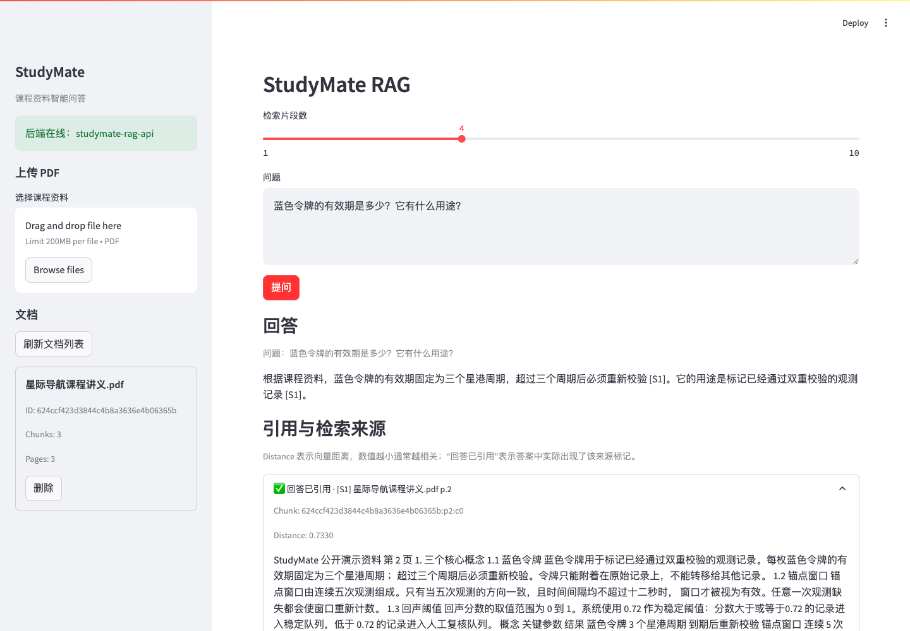

# StudyMate RAG

[](https://github.com/raynegao/StudyMate-RAG/actions/workflows/ci.yml)
[](LICENSE)

StudyMate RAG 是一个面向课程 PDF 的资料问答系统。它使用本地 BGE 模型生成向量、通过 ChromaDB 检索相关片段，再调用 DeepSeek 生成带来源标记的回答。



## English summary

StudyMate RAG is a local-first question-answering system for Chinese course PDFs. It combines `BAAI/bge-small-zh-v1.5` embeddings, ChromaDB retrieval, DeepSeek generation and verifiable page-level citations behind a FastAPI API and Streamlit interface. The repository includes locked Python 3.12 dependencies, non-root Docker images, automated quality gates, a 30-question public benchmark and an isolated real-stack Docker E2E check.

Key evidence:

- 30 questions over 3 fully fictional public PDFs, with gold document, page and answer-keyword annotations
- Recall@1 and MRR@1 of 100% for BGE on the public synthetic benchmark
- 100% deterministic keyword answer accuracy and citation accuracy across 30 real DeepSeek calls
- Isolated Docker verification of real BGE, ChromaDB persistence across backend restart, DeepSeek answers and cleanup
- Machine-readable results and a reproducible 75-second demonstration video

See the [quantitative evaluation](docs/evaluation.md), [architecture](docs/architecture.md), [API contract](docs/api.md) and [75-second demo video](output/demo/studymate-rag-demo-75s.mp4).

## 主要功能

- 分块接收 PDF，并实时限制文件大小
- 保留中文文件名，阻止路径穿越和危险文档 ID
- 识别损坏、加密、无文本和纯扫描 PDF，并返回统一 JSON 错误
- 使用 `BAAI/bge-small-zh-v1.5` 和 ChromaDB 完成语义检索
- 使用 `[S1]`、`[S2]` 标记回答实际引用的来源
- 区分“回答已引用”和“仅检索候选”，展示向量距离
- 支持文档列表、幂等删除和删除前二次确认
- 支持本地运行、Docker Compose 和自动化质量检查

## 技术栈

- Python 3.12、FastAPI、Pydantic、Uvicorn
- sentence-transformers、BGE、ChromaDB
- DeepSeek Chat API
- Streamlit
- pytest、Ruff、coverage、Docker Compose

## 快速开始

### 1. 安装运行依赖

项目使用 `uv` 和锁定依赖，避免不同机器上的 Python、Torch 和 gRPC 版本漂移。

```bash
uv venv --python 3.12
uv pip sync --python .venv/bin/python --torch-backend cpu backend/requirements.txt
source .venv/bin/activate
```

开发和测试环境改用开发锁文件：

```bash
uv pip sync --python .venv/bin/python --torch-backend cpu backend/requirements-dev.txt
```

### 2. 配置 DeepSeek

```bash
cp .env.example .env.local
chmod 600 .env.local
```

编辑 `.env.local`，填写 `DEEPSEEK_API_KEY`，然后在启动终端加载：

```bash
set -a
source .env.local
set +a
```

`.env`、`.env.local`、上传文件、Chroma 数据和模型缓存均已被 Git 忽略。

### 3. 本地启动

终端一：

```bash
scripts/run_backend.sh
```

终端二：

```bash
scripts/run_frontend.sh
```

访问：

- Streamlit：`http://127.0.0.1:8501`
- FastAPI 文档：`http://127.0.0.1:8000/docs`

首次上传 PDF 会下载 BGE 模型，耗时取决于网络和磁盘速度。

## Docker Compose

```bash
docker compose --env-file .env.local up --build
```

Compose 只构建一份应用镜像，后端和前端复用该镜像。运行时使用非 root 用户，上传目录和 Chroma 目录挂载到宿主机，BGE 缓存在 `studymate_hf_cache` volume 中。

模型缓存完成后，可以在 `.env.local` 中显式开启离线模式：

```dotenv
HF_HUB_OFFLINE=1
TRANSFORMERS_OFFLINE=1
```

停止服务：

```bash
docker compose down
```

## 公开演示资料

仓库包含一份完全虚构、无个人信息的中文样例：

- [studymate-demo-course.pdf](output/pdf/studymate-demo-course.pdf)
- [上传与文档列表截图](output/playwright/studymate-upload-and-documents.png)
- [问答与引用截图](output/playwright/studymate-question-and-citations.png)
- [真实问答验收记录](output/demo/studymate-demo-response.json)
- [75 秒完整演示视频](output/demo/studymate-rag-demo-75s.mp4)

重新生成样例 PDF：

```bash
.venv/bin/python scripts/generate_demo_pdf.py
```

建议问题：

```text
蓝色令牌的有效期是多少？它有什么用途？
```

## 量化评测

仓库包含 3 份完全虚构的公开 PDF 和 30 道中文问题。每道题都标注标准文档、页码和答案关键词，评测脚本使用真实 BGE，并对比字符 n-gram 词法基线、3 组 chunk size 和 3 组 `top_k`。

当前公开合成集结果：

- BGE Recall@1：100%
- BGE MRR@1：100%
- 30 次真实 DeepSeek 调用的关键词回答正确率：100%
- 引用准确率与 grounded-answer rate：100%
- 平均 DeepSeek 生成延迟：1.51 秒；P95：2.08 秒

```bash
.venv/bin/python scripts/generate_evaluation_assets.py
.venv/bin/python scripts/evaluate_rag.py

set -a && source .env.local && set +a
.venv/bin/python scripts/evaluate_rag.py --with-llm
```

完整方法、对比表和局限性见 [docs/evaluation.md](docs/evaluation.md)，机器可读结果见 [evaluation-results.json](output/evaluation/evaluation-results.json)。这些结果来自小规模合成基准，证明可复现性，不代表真实课程域的泛化上限。

## API 示例

上传 PDF：

```bash
curl -X POST http://127.0.0.1:8000/api/upload \
  -F "file=@output/pdf/studymate-demo-course.pdf"
```

提问时可以省略 `top_k`，此时使用 `STUDYMATE_TOP_K`：

```bash
curl -X POST http://127.0.0.1:8000/api/chat \
  -H "Content-Type: application/json" \
  -d '{"question":"蓝色令牌的有效期是多少？"}'
```

来源中的 `distance` 是向量距离，通常越小越相关；`cited=true` 表示答案中实际出现了对应 `citation_id`。

完整接口说明见 [docs/api.md](docs/api.md)。

## 测试与验证

```bash
scripts/test.sh
docker compose config --quiet
docker build --check .
.venv/bin/python scripts/run_docker_e2e.py
```

`scripts/test.sh` 会依次执行 Ruff、`compileall`、pytest coverage 和依赖一致性检查。CI 使用 Python 3.12，并要求后端覆盖率不低于 70%。

`scripts/run_docker_e2e.py` 使用临时上传与 Chroma 目录启动隔离 Compose 项目，自动验证真实 BGE、真实 DeepSeek、前后端健康、后端重启持久化、文档删除和清理。GitHub 的 `Real-stack E2E` workflow 可以在配置仓库 Secret 后手动运行，不会让外部 API 依赖阻塞常规 CI。

2026-08-17 的发布检查结果：51 项测试通过，后端覆盖率 84.99%；Compose 与 Dockerfile 检查通过；30 题真实 BGE/DeepSeek 评测完成；隔离 Docker E2E 完成真实模型调用与重启持久化验证。

## 项目结构

```text
backend/app/api/          上传、问答和文档管理接口
backend/app/core/         配置、日志和统一错误处理
backend/app/models/       Pydantic 请求与响应模型
backend/app/services/     PDF、chunk、embedding、Chroma 和 RAG 流程
frontend/                 Streamlit 页面
scripts/                  启动、测试、smoke 和样例生成脚本
tests/                    API、服务层和前端辅助函数测试
docs/                     架构、API、演示和简历材料
evaluation/               公开 30 题基准及标准文档/页码/答案标注
output/                   可公开使用的样例与截图
data/                     本地上传文件和 Chroma 数据，不提交内容
```

## 当前边界

当前版本为 `0.3.0`，聚焦稳定的单知识库 PDF 问答闭环，不包含 OCR、Hybrid Search、Rerank、Query Rewrite、多轮记忆、用户系统或云部署。

## License

This project is released under the [MIT License](LICENSE).
