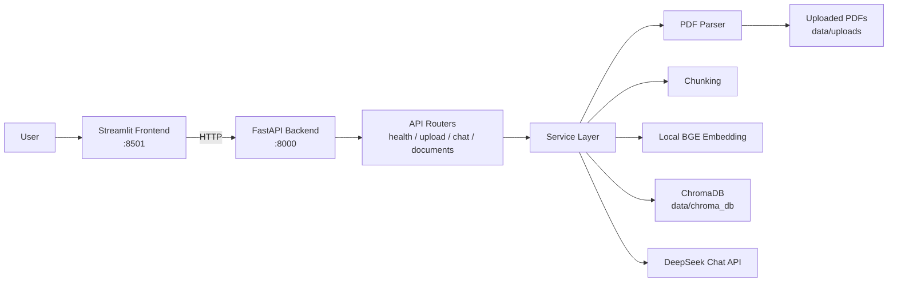
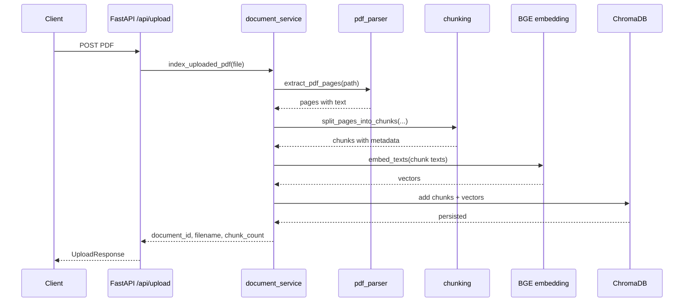
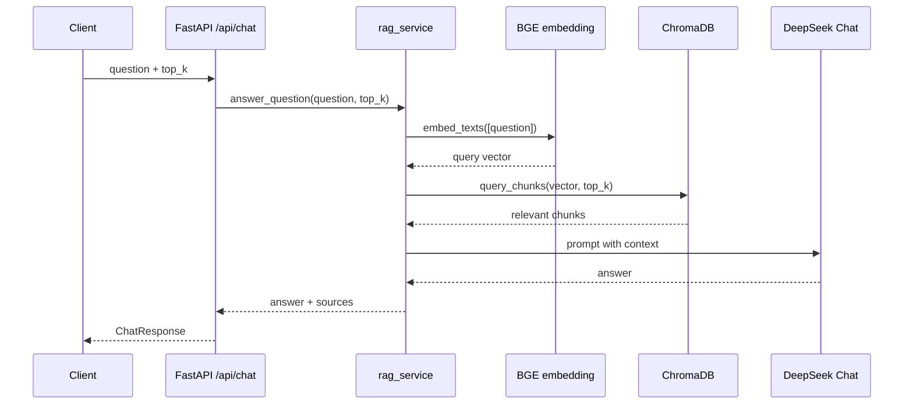

# StudyMate RAG Architecture

## 目标

StudyMate RAG 展示版聚焦一个稳定闭环：上传课程 PDF，系统解析并索引资料，用户提问后基于检索到的资料片段生成答案，并展示引用来源。

本阶段强调本地可运行、Docker 可启动、接口可测试和项目可展示；不引入用户系统、多知识库、Hybrid Search、Rerank、Query Rewrite、多轮对话或云部署。

## 系统结构



## 后端边界

FastAPI 只负责 HTTP 请求、响应模型和错误转换。RAG 业务逻辑在 service 层完成：

- `document_service`: 保存上传 PDF、解析、切分、embedding、写入向量库。
- `rag_service`: 问题 embedding、向量检索、prompt 构造、LLM 调用、引用整理。
- `vector_store`: 封装 ChromaDB 的写入、查询、文档列表和删除。
- `embedding_service`: 封装本地 BGE embedding，避免 API 层直接依赖模型实现。
- `llm_service`: 封装 DeepSeek Chat 调用。

## 数据流

### 上传与索引



### 问答



## 配置

配置来自环境变量，示例见 `.env.example`。

关键变量：

- `DEEPSEEK_API_KEY`: DeepSeek Chat 调用密钥。
- `DEEPSEEK_BASE_URL`: DeepSeek API 地址，默认 `https://api.deepseek.com`。
- `STUDYMATE_LOCAL_EMBEDDING_MODEL`: 默认 `BAAI/bge-small-zh-v1.5`。
- `STUDYMATE_LLM_MODEL`: 默认 `deepseek-v4-flash`。
- `STUDYMATE_UPLOAD_DIR`: 上传 PDF 存储目录。
- `STUDYMATE_CHROMA_DIR`: ChromaDB 持久化目录。
- `STUDYMATE_CHUNK_SIZE` / `STUDYMATE_CHUNK_OVERLAP`: chunk 参数。
- `STUDYMATE_API_BASE_URL`: Streamlit 调用后端的地址。

## 持久化

- `data/uploads/`: 保存上传的 PDF，仓库只保留 `.gitkeep`。
- `data/chroma_db/`: 保存 ChromaDB 索引，仓库只保留 `.gitkeep`。
- Docker Compose 将这两个目录挂载到容器中，重启后本地数据仍保留。
- BGE 模型缓存使用 Docker volume `studymate_hf_cache`，避免每次重建后重复下载。

## 错误处理

后端统一返回：

```json
{
  "error": {
    "code": "bad_request",
    "message": "错误说明",
    "details": {}
  }
}
```

常见错误包括：

- `unsupported_file_type`: 上传文件不是 PDF。
- `validation_error`: 请求参数不合法。
- `llm_not_configured`: 没有配置 DeepSeek API Key。
- `embedding_failed`: 本地 embedding 生成失败。
- `llm_request_failed`: DeepSeek 请求失败。

## 后续增强方向

- 多文档分组和多知识库隔离。
- Hybrid Search 和 Rerank。
- Query Rewrite。
- 多轮对话和 Conversation Memory。
- 更完整的可观测性和云部署。
