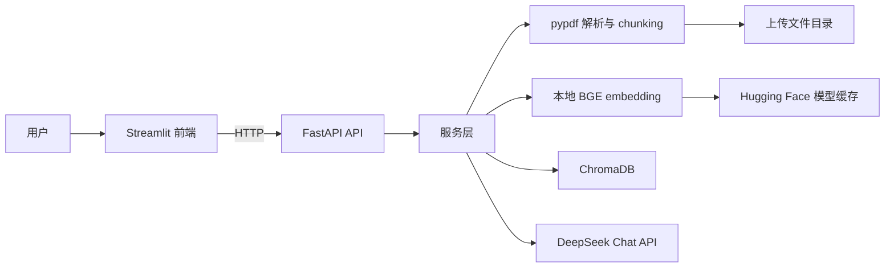
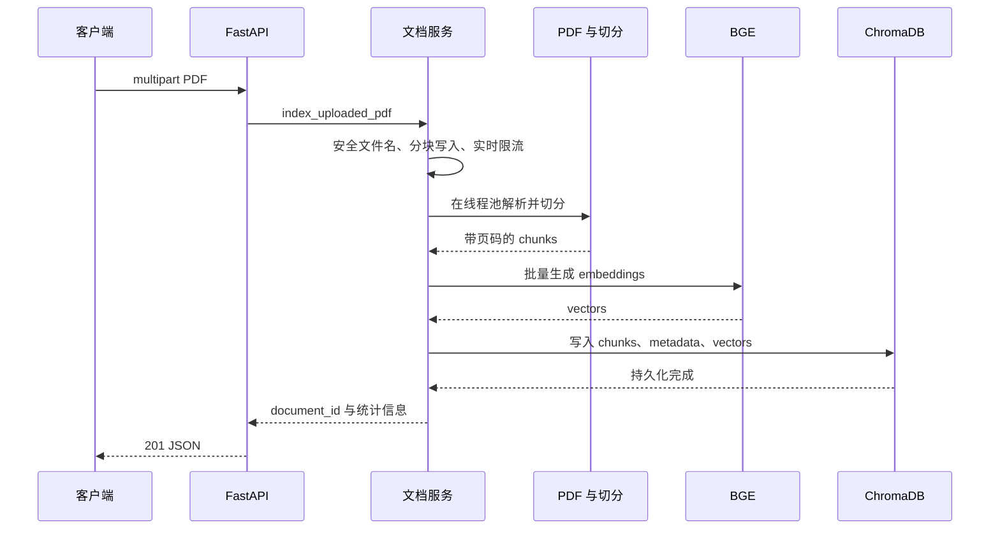
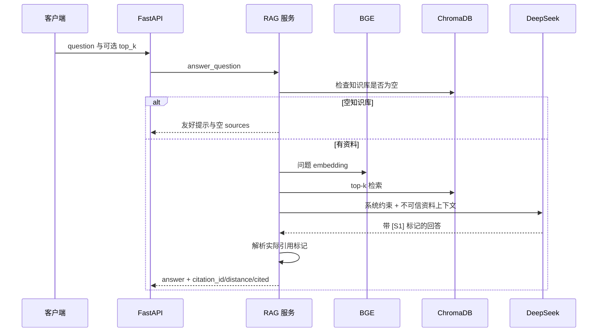

# StudyMate RAG 架构

## 目标与边界

当前版本实现单知识库 PDF 问答闭环：上传、解析、切分、向量化、检索、生成回答和引用展示。OCR、Hybrid Search、Rerank、Query Rewrite、多轮记忆和多知识库不在本版本范围内。

## 系统结构

## 模块职责

- `api/`：HTTP 参数、响应 schema、线程池调度和错误转换
- `services/document_service.py`：上传文件落盘与索引事务
- `services/pdf_parser.py`：损坏、加密和无文本 PDF 分类
- `services/chunking.py`：按页切分并保留页码、文件名和 chunk ID
- `services/embedding_service.py`：延迟加载 BGE，封装初始化和推理异常
- `services/vector_store.py`：Chroma CRUD 和距离返回
- `services/rag_service.py`：空库短路、检索、prompt 构造和引用解析
- `services/llm_service.py`：DeepSeek 客户端与系统级安全约束
- `core/errors.py`：类型化服务异常和统一 JSON 错误

## 上传流程

上传、解析、embedding 或 Chroma 任一步失败，都会删除本次残留文件。同步的 PDF、模型、Chroma 和 LLM 工作通过线程池移出 FastAPI 事件循环。

## 问答与引用

系统消息明确把 PDF 内容视为不可信资料，并要求忽略资料正文中的指令。前端根据 `cited` 区分模型实际引用与仅被检索到的候选片段。

## 存储和容器

- 上传文件：`data/uploads/`
- Chroma 索引：`data/chroma_db/`
- BGE 缓存：Docker named volume `studymate_hf_cache`
- 宿主机目录可通过 `STUDYMATE_HOST_UPLOAD_DIR` 和 `STUDYMATE_HOST_CHROMA_DIR` 覆盖
- 模型卷名称可通过 `STUDYMATE_HF_CACHE_VOLUME` 覆盖，方便隔离验收

Compose 的后端和前端复用同一生产镜像。镜像只安装运行依赖，并以 UID/GID 10001 的非 root 用户启动。首次下载模型时保持在线；缓存完整后才设置 `HF_HUB_OFFLINE=1` 和 `TRANSFORMERS_OFFLINE=1`。

## 依赖与质量门禁

- Python 固定为 3.12
- `requirements.txt` 为运行锁，`requirements-dev.txt` 为开发锁
- CI 执行 Ruff、`compileall`、pytest coverage、Compose 配置和 Dockerfile 检查
- 后端覆盖率阈值为 70%
- `evaluation/benchmark.json` 提供 30 题公开标注，`scripts/evaluate_rag.py` 使用真实 BGE 计算 Recall@K、MRR、延迟和真实 DeepSeek 的答案/引用指标
- `scripts/run_docker_e2e.py` 在临时数据目录中自动验证前后端、真实模型、Chroma 重启持久化与删除清理
- `Real-stack E2E` GitHub workflow 采用手动触发，避免 Secret 和外部模型网络波动影响常规 CI
