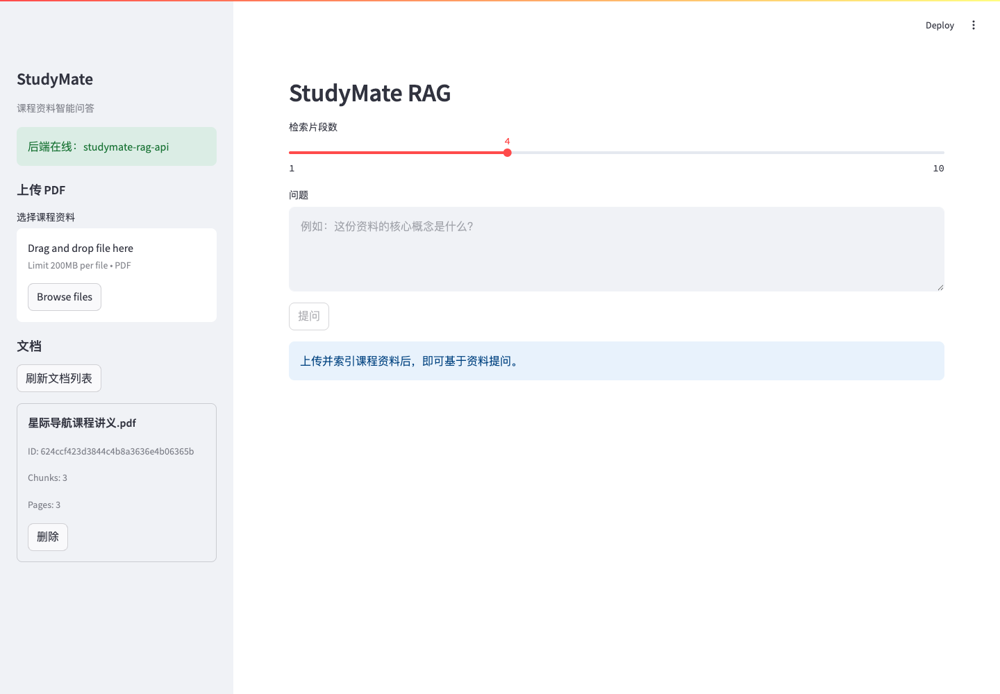

# StudyMate RAG 演示指南

演示只使用仓库内的公开虚构样例，避免展示私人课程资料、环境文件或 API Key。

## 准备

1. 在 `.env.local` 中配置 `DEEPSEEK_API_KEY`。
2. 确认 Docker Desktop 已启动。
3. 使用 [studymate-demo-course.pdf](../output/pdf/studymate-demo-course.pdf) 作为上传资料。

## Docker 演示

```bash
docker compose --env-file .env.local up --build
```

等待两个服务健康后，打开 `http://127.0.0.1:8501`。

### 1. 上传

在侧边栏选择样例 PDF，点击“上传并索引”。首次运行会下载 `BAAI/bge-small-zh-v1.5`，之后模型缓存在 named volume 中。

可讲解的处理顺序：

```text
分块保存 -> PDF 解析 -> 按页切分 -> BGE embedding -> ChromaDB 持久化
```

### 2. 提问

```text
蓝色令牌的有效期是多少？它有什么用途？
```

预期要点：

- 有效期是三个星港周期
- 用于标记已经通过双重校验的观测记录
- 回答正文包含 `[S1]` 等有效来源标记

### 3. 查看来源

- 展开“回答已引用”的来源，核对文件名、页码、chunk、distance 和原文
- 说明 distance 是向量距离，数值越小通常越相关
- 指出“仅检索候选”没有被答案实际引用

### 4. 删除

点击文档旁的“删除”，页面会再次确认原始上传文件和向量索引都会被移除。取消不会修改数据。

## 已验证结果

2026-07-20 使用全新的临时上传目录、Chroma 目录和 BGE 缓存卷完成以下检查：

- Docker 镜像构建与前后端健康检查通过
- 首次 BGE 下载成功
- 中文文件名 `星际导航课程讲义.pdf` 完整返回
- 上传后重启后端，文档和向量索引仍可列出
- DeepSeek 返回正确答案并包含 `[S1][S2]`
- 前端正确区分实际引用与检索候选
- 浏览器控制台无错误或警告

问答响应摘要见 [studymate-demo-response.json](../output/demo/studymate-demo-response.json)。

## 展示截图




## 本地运行备选

```bash
set -a && source .env.local && set +a
scripts/run_backend.sh
```

另开终端：

```bash
set -a && source .env.local && set +a
scripts/run_frontend.sh
```

演示结束后执行：

```bash
docker compose down
```
